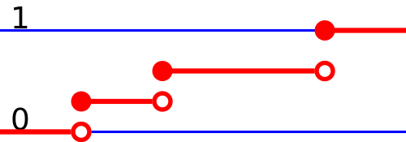

# Random Variables and their Distributions

Discrette Random Variables - Summation
Continous Random Variables - Integration  

## Random Variable

Function that assigns a number to an event ($X(\omega) : \Omega \rightarrow \mathbb{R}$)

## Distribution Function

Probability measure (likelihood to events), distribution function link random variable to probability measure

Binomial distribution - closed range
Poisson distribution - infinite range

Independence - outcomes does not affect each other
